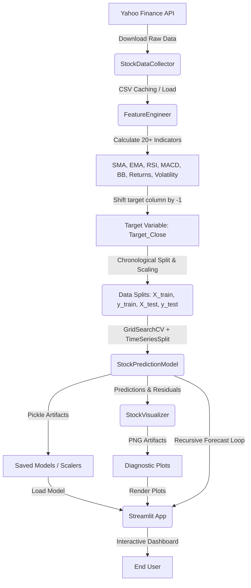

# 📈 Stock Price Prediction & Analytics Dashboard (Random Forest Regression)

An end-to-end, production-quality machine learning project that collects historical stock market data, engineers technical indicators, trains an optimized **Random Forest Regressor** using time-series cross-validation, and provides interactive visualizations and recursive 7-day future forecasts via a **Streamlit** dashboard.

---

## 📋 Table of Contents
1. [Project Overview](#-project-overview)
2. [System Architecture](#-system-architecture)
3. [Key Features](#-key-features)
4. [Installation Guide](#-installation-guide)
5. [Usage Instructions](#-usage-instructions)
6. [Model Evaluation & Interpretability](#-model-evaluation--interpretability)
7. [Frequently Asked Questions (FAQ)](#-frequently-asked-questions-faq)
8. [Resume Project Description](#-resume-project-description)

---

## 🔍 Project Overview
Predicting stock price movements is a classic yet challenging time-series forecasting problem. This project implements a machine learning system using a **Random Forest Regressor** in Python. 

Unlike standard regressions that assume linear relationships, Random Forest is a non-parametric tree ensemble capable of capturing complex, non-linear interactions among technical indicators without requiring heavy feature scaling (though scaling is included for standardisation).

### Core Goals:
* **Automated Data Fetching**: Pull historical daily stock data from Yahoo Finance API (`yfinance`).
* **Feature Engineering**: Compute 20+ technical indicators across moving averages, momentum, volatility, and volume indicators.
* **Leakage-Free Validation**: Use chronological splitting and `TimeSeriesSplit` cross-validation to maintain temporal order.
* **Explainability**: Rank feature importances to reveal which technical signals are driving the predictions.
* **Recursive Multi-Step Forecasting**: Implementation of an iterative forecast loop to predict stock prices 7 trading days into the future.
* **Interactive UI**: Visualise trends, metrics, and diagnostics using a beautiful Streamlit dashboard.

---

## 🏗️ System Architecture

The project follows modular Object-Oriented Programming (OOP) design patterns.

### System Dataflow


### Module Descriptions
1. **`src/logger.py`**: Standardizes log messages across console and files.
2. **`src/data_collector.py`**: Connects to yfinance API, downloads raw data, and implements file-based CSV caching.
3. **`src/feature_engineer.py`**: Cleans data, generates indicators, creates target labels, splits train/test datasets chronologically, and fits feature scalers.
4. **`src/model_pipeline.py`**: Manages model training, grid-search hyperparameter optimization, test evaluation (MAE, RMSE, R², MAPE), and recursive multi-step forecasting.
5. **`src/visualizer.py`**: Generates publication-quality Seaborn charts (Actual vs Predicted, Feature Importance, Residual Errors, Heatmap).
6. **`src/train.py`**: Orchestrates the backend execution command line pipeline.
7. **`app.py`**: Streamlit application rendering the UI dashboard.

---

## 🛠️ Installation Guide

### Prerequisites
* Python 3.10+ (tested on Python 3.13.x)
* Conda or Python Virtual Environment (recommended)

### Steps
1. **Clone or navigate to the workspace directory**:
   ```bash
   cd d:/stockprediction
   ```

2. **Create and activate a virtual environment (optional but recommended)**:
   ```bash
   python -m venv venv
   # On Windows (PowerShell):
   .\venv\Scripts\Activate.ps1
   # On macOS/Linux:
   source venv/bin/activate
   ```

3. **Install dependencies**:
   ```bash
   pip install -r requirements.txt
   ```

---

## 🚀 Usage Instructions

### Running the Backend CLI Pipeline
You can download, train, evaluate, and save models directly from the command line:
```bash
# General Syntax
python -m src.train --ticker <TICKER> --years <YEARS> [--no_tune]

# Examples:
# Train AAPL with hyperparameter tuning (Grid Search)
python -m src.train --ticker AAPL --years 5

# Train MSFT without hyperparameter tuning (faster using default params)
python -m src.train --ticker MSFT --years 5 --no_tune
```
Outputs from the training script (e.g. models, charts, forecasts) are stored under `models/` and `images/`.

### Starting the Streamlit Dashboard
Launch the web interface locally using:
```bash
streamlit run app.py
```
This starts a local development web server (typically at `http://localhost:8501`).

---

## 📊 Model Evaluation & Interpretability

The model calculates five primary performance metrics:
1. **MAE (Mean Absolute Error)**: Average magnitude of the absolute errors.
2. **MSE (Mean Squared Error)**: Average of the squared errors, penalizing larger deviations.
3. **RMSE (Root Mean Squared Error)**: Square root of MSE, representing error in the original price unit.
4. **R² Score (Coefficient of Determination)**: Proportion of variance in the target variable explainable by the features.
5. **MAPE (Mean Absolute Percentage Error)**: Mean percentage deviation, giving relative scale of errors.

### Engineered Technical Indicators:
* **SMA (10, 20, 50)**: Simple Moving Average capturing short, mid, and long-term trend baselines.
* **EMA (10, 20)**: Exponential Moving Average putting higher weight on recent price updates.
* **RSI (14)**: Relative Strength Index measuring momentum velocity to flag overbought/oversold levels.
* **MACD**: Moving Average Convergence Divergence capturing trend-following momentum changes.
* **Bollinger Bands (20, 2)**: Volatility channels capturing price deviation relative to a simple moving average.
* **Daily Returns**: Percentage price change day-over-day.
* **Volatility**: 20-day rolling standard deviation of daily returns.
* **Volume Change**: Percentage changes in trading volume to identify market interest spikes.

---

## ❓ Frequently Asked Questions (FAQ)

### 1. Is an internet connection required to train the model?
* **Model Training & Forecasting (Local)**: **No.** The actual training of the `RandomForestRegressor`, hyperparameter grid searching (`GridSearchCV`), and future forecasting loop run 100% locally on your machine using `scikit-learn` and your local CPU.
* **Data Fetching (Internet Required / Cache Fallback)**: **Sometimes.** The system first checks for a local file in your `data/` directory (e.g., `data/AAPL_historical.csv`). If it exists, covers the requested timeline, and is up-to-date (ending within 1 day of today), it loads the data offline. If the file is missing or outdated, an active internet connection is required to fetch fresh data from the Yahoo Finance API (`yfinance`).

### 2. Can I upload these datasets to Kaggle?
* **Yes.** Historical stock prices are public facts and sharing them for personal projects, portfolios, or education is highly common.
* **Licensing**: Since the data is retrieved from Yahoo Finance, you must use it for **non-commercial** purposes. It is recommended to use the **Creative Commons Attribution-NonCommercial-ShareAlike (CC BY-NC-SA 4.0)** license.
* **How to Upload**:
  * **Web UI**: Go to [Kaggle](https://www.kaggle.com/), click **Datasets** -> **New Dataset**, and drag-and-drop the CSV files from your local `d:\stockprediction\data\` directory.
  * **Kaggle CLI**:
    ```bash
    pip install kaggle
    kaggle datasets init -p data/
    # (Optional) Edit data/datapackage.json with your dataset details
    kaggle datasets create -p data/
    ```

---

## 📄 Resume Project Description

Here is a professional resume description you can add to your CV:

### **Senior Machine Learning Engineer | Stock Price Prediction & Analytics Platform**
* **Technologies**: Python, Scikit-Learn (Random Forest), Pandas, NumPy, yfinance, Matplotlib, Seaborn, Streamlit, Plotly, Git.
* Developed an end-to-end production-grade machine learning system to predict next-day stock closing prices using a **Random Forest Regressor**, achieving robust trading indicator signals.
* Engineered **20+ technical indicators** (including SMA, EMA, RSI, MACD, Bollinger Bands, rolling volatility, and volume percentage changes) to construct a comprehensive time-series feature space.
* Implemented a leak-proof training pipeline applying **chronological splitting** and **TimeSeriesSplit cross-validation** to eliminate lookahead bias and ensure rigorous, realistic out-of-sample evaluations.
* Integrated **GridSearchCV** hyperparameter tuning, optimizing tree counts, tree depths, split thresholds, and leaf sizes, reporting key validation metrics (MAE, RMSE, R² Score, and MAPE).
* Authored a recursive multi-step forecasting loop that updates historical values and recompute indicators dynamically to forecast stock prices **7 trading days into the future**.
* Built and deployed a highly interactive, responsive **Streamlit dashboard** equipped with customizable moving average overlays, MACD/RSI oscillator charts, correlation heatmaps, feature importance interpretability tabs, and data export features.
